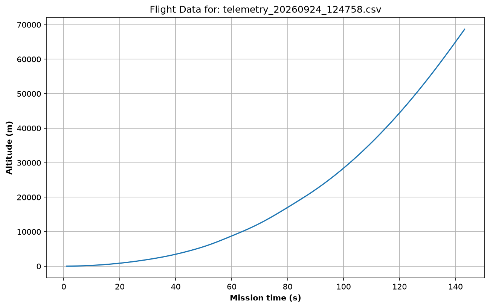

# Rocket Launch & Telemetry Simulation


Physics-based multi-stage rocket simulation in Python.

Focuses on Newtonian mechanics, staging, guidance, and telemetry — not graphics.

Models a Falcon 9–class vehicle through ascent to near-orbital conditions.

**Full orbital insertion / circularization is not implemented yet.**

**Version 1.2.0** — packaged layout, config-driven vehicle, extracted guidance, console + CSV telemetry, CLI fast mode, and unit tests on guidance.

---

## What this project demonstrates

- Separation of **vehicle data** (config), **guidance laws** (pure functions), and **flight sequencing** (state machine on the rocket)
- Multi-stage mass/fuel accounting and fairing jettison
- Testable pitch guidance without running a full ascent
- Practical operator tooling: live telemetry, CSV export, `--fast` runs

---

## Features

- Multi-stage vehicle with per-stage fuel and mass
- State-machine flight phases (launch → pitch kick → ascent → staging → stage 2 → coast)
- Configurable guidance (pitch initiation, stage 1 & 2 pitch programs)
- Thrust, gravity, and atmospheric drag
- Fairing jettison
- Live console telemetry
- CSV telemetry logging (timestamped files under `telemetry_data/`)
- Fast mode for quicker test runs
- Unit tests for pitch initiation
- Unit tests for guidance and stage mass/fuel behavior
- CI via GitHub Actions (pytest on push to `main`)
- Script to plot altitude vs time from the latest telemetry CSV

---

## Project layout

```text
src/rocket_sim/
├── cli.py         # Entry point / simulation loop
├── utils.py       # CLI helpers (time string, --fast flag)
├── config/        # Dataclasses + Falcon 9 vehicle data
├── models/        # Rocket, Stage
├── guidance/      # Pitch initiation, stage 1 & 2 guidance
├── physics/       # Forces and motion helpers
└── telemetry/     # Console formatter + CSV recorder

tests/
└── unit/          # Guidance unit tests
```

- Vehicle numbers live in `config/` (especially `falcon9_config.py`).
- Guidance logic lives under `guidance/`.
- The rocket state machine orchestrates flight phases.

### Design notes

| Concern | Where it lives |
| :--- | :--- |
| Masses, thrusts, pitch schedules (degrees) | `config/` + Falcon 9 data module |
| Pitch programs (pure functions) | `guidance/` |
| Flight phase sequencing, staging | `models/rocket.py` state machine |
| Forces / kinematics helpers | `physics/` |
| Presenting and logging telemetry | `telemetry/` |

- Guidance config values are in degrees; conversion to radians happens inside guidance functions.
- Runtime state (fuel remaining, current pitch, flags) lives on Rocket / Stage, not in config objects.

---

## Requirements

- Python 3.10+
- `uv` recommended (or `pip`)

---

## Setup

```bash
git clone https://github.com/RobM-Tech/Rocket-Simulation.git
cd Rocket-Simulation
uv venv
source .venv/bin/activate  # Windows: .venv\Scripts\activate
uv pip install -e .
```

### Development install (tests)

```bash
uv pip install -e ".[dev]"
```

This pulls optional dev dependencies (including `pytest`). Runtime simulation does not require `pytest`.

---

## Run

From the project root, with the virtual environment active:

```bash
python -m rocket_sim.cli
```

### Fast mode

Skips per-step sleep so a run finishes in seconds instead of several minutes. Console telemetry and CSV logging still run.

```bash
python -m rocket_sim.cli --fast
```

or:

```bash
uv run -m rocket_sim.cli --fast
```

Without `--fast`, the loop sleeps each step so the readout is watchable in roughly real time.

---

## Tests

```bash
uv pip install -e ".[dev]"  # if not already installed
pytest
```

or:

```bash
uv run pytest
```

Unit tests cover pitch initiation and stage 1 / stage 2 guidance (branch selection, rate limiting, throttle bias) without a full mission run.

The same suite runs in CI on every push to `main` (see the **Actions** tab).

---

## Telemetry CSV

During a run, telemetry is appended every 100 steps (and once at the end) to a timestamped file:

```text
telemetry_data/telemetry_YYYYMMDD_HHMMSS.csv
```

The directory is created if missing. Generated CSV files are gitignored.

---

## Sample output

After a run, CSVs land in `telemetry_data/`. You can generate a quick altitude history plot:

```bash
python scripts/plot_run.py

Altitude vs mission time from a logged CSV run:



## Configuration

Edit `src/rocket_sim/config/falcon9_config.py` to tune:
- Stage masses, thrust, burn rate
- Pitch schedules and staging thresholds
- Payload / fairing / reference area

---

## Current limits

- Reaches roughly orbital horizontal speed at high altitude, but does not model a circular orbit
- No orbital insertion or closed-orbit propagation yet
- Rocket still concentrates sequencing, throttling, and telemetry collection (incremental cleanup ongoing)

---