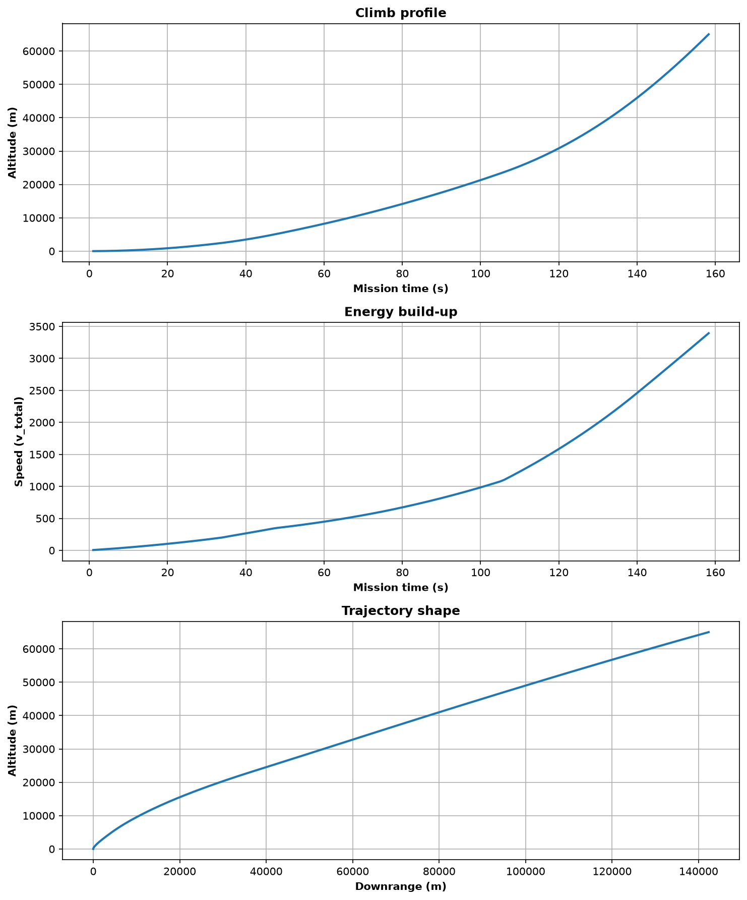

# Rocket Launch & Telemetry Simulation


A physics-based, multi-stage rocket simulation in Python. This project focuses on Newtonian mechanics, staging, guidance, and telemetry rather than graphic visualizations. It models a Falcon 9–class vehicle through ascent to near-orbital conditions.

**Important Note:** Full orbital insertion and closed-orbit circularization propagation are not implemented yet.

**Version 1.3.0** — Packaged layout, configuration-driven vehicle parameters, extracted flight profile boundaries, console and CSV telemetry, CLI fast mode, and stateless kinematics.

## Core Architectural Concepts

* **Separation of Concerns:** Distinct separation of vehicle data configurations, pure-function guidance laws, and rocket state-machine flight sequencing.
* **Aerodynamic Systems:** Tracks dynamic pressure (Q) for real-time Max-Q peak structural load monitoring and models transonic wave-drag coefficient (\(C_d\)) spikes between Mach 0.8 and Mach 1.2.
* **Deep Space Boundaries:** Implements clamped barometric altitudinal scaling to prevent mathematical domain errors at high boundaries exceeding 150 km.

## Requirements

* Python 3.10+
* uv package manager (recommended) or pip

## Installation and Setup

Clone the repository and configure the virtual environment:

```bash
git clone https://github.com/RobM-Tech/Rocket-Simulation.git
cd Rocket-Simulation
uv venv
source .venv/bin/activate  # On Windows use: .venv\Scripts\activate
uv pip install -e ".[dev]"
```

## Running the Simulation

Execute the main package script from the root directory:

```bash
python -m rocket_sim.cli
```

### Fast Mode
To skip per-step execution sleep cycles and complete the run in seconds, append the fast flag:

```bash
python -m rocket_sim.cli --fast
```

### Phased Runs
To terminate execution at a specific flight milestone for debugging, utilize the until flag:

```bash
python -m rocket_sim.cli --until MECO
python -m rocket_sim.cli --fast --until SECO
```

| Phase Flag | Execution Behavior |
| :--- | :--- |
| **FULL** | Runs until orbit coast. The simulation ends here by design. |
| **MECO** | Terminates execution at main-engine cutoff / Stage 1 MECO. |
| **SECO** | Terminates execution at second-engine cutoff. |

## Verification and Testing

Execute the test suite using pytest to verify pitch initiation and guidance branch logic:

```bash
uv run pytest
```

The testing suite automatically runs in continuous integration workflows on every push to the main branch.

<details>
    <summary><h3><b>Features Specification</b></h3></summary>

* Multi-stage vehicle with individual per-stage fuel and mass accounting.
* State-machine flight phases tracking sequence: launch, pitch kick, ascent, staging, stage 2, and coast.
* Configurable guidance parameters for pitch initiation and active staging programs.
* Comprehensive force handling accounting for thrust, gravity, and atmospheric drag.
* Fairing jettison milestones during optimal altitude windows.
</details>

<details>
    <summary><h3><b>Project Layout and Design Notes</b></h3></summary>

```text
src/rocket_sim/
├── cli.py         # Entry point and core simulation loop
├── utils.py       # CLI helpers, time formatting, and flag parsing
├── config/        # Dataclasses and Falcon 9 vehicle data specifications
├── models/        # Rocket, Stage models, and flight phase state machine
├── guidance/      # Pitch initiation algorithms, stage 1 and stage 2 programs
├── physics/       # Stateless aerodynamic forces and kinematics engine
└── telemetry/     # Console telemetry formatters and CSV logging recorders

tests/
└── unit/          # Guidance and routing unit tests
```

### Component Breakdown

| Operational Concern | Core Location |
| :--- | :--- |
| Masses, thrust curves, pitch schedules | `config/` and vehicle data modules |
| Pitch programs and steering algorithms | `guidance/` as pure functions |
| Flight phase sequencing and staging logic | `models/rocket.py` state machine |
| Core physical helper functions | `physics/` |
| Console reporting and CSV exports | `telemetry/` |

* Guidance configuration inputs are defined in degrees; radian conversion is entirely isolated inside guidance runtime functions.
* Runtime tracking data (remaining propellants, current pitch angle, state events) lives on active `Rocket` and `Stage` instances, ensuring structural configuration classes remain completely immutable.
</details>

<details>
    <summary><h3><b>Telemetry Outputs and Analytics</b></h3></summary>

During runtime execution, operational telemetry is appended every 100 steps to log files under targeted phase directories:

```text
telemetry_data/data_MECO/
telemetry_data/data_SECO/
telemetry_data/data_FULL/
```

### Data Visualization
To compile, parse, and review historical flight performance graphs:

```bash
python scripts/plot_run.py
```

Output plots map directly to tracking directories matching your execution parameters (`docs/plot_MECO`, `docs/plot_SECO`, etc.).

**Flight Analysis Profile:** Telemetry visualizations reflect a distinct flattening velocity curve mid-ascent between 60 seconds and 80 seconds. This profile indicates vehicle throttling to mitigate atmospheric structural stress while transiting through maximum aerodynamic pressure (Max-Q).


</details>

## Configuration Changes

Modify the definitions within `src/rocket_sim/config/falcon9_config.py` to change parameters:
* Stage structural masses, dry weights, fuel totals, and engine burn capacities.
* Pitch program triggering parameters and structural separation thresholds.
* Payload configurations, payload fairing masses, and aerodynamic reference target areas.